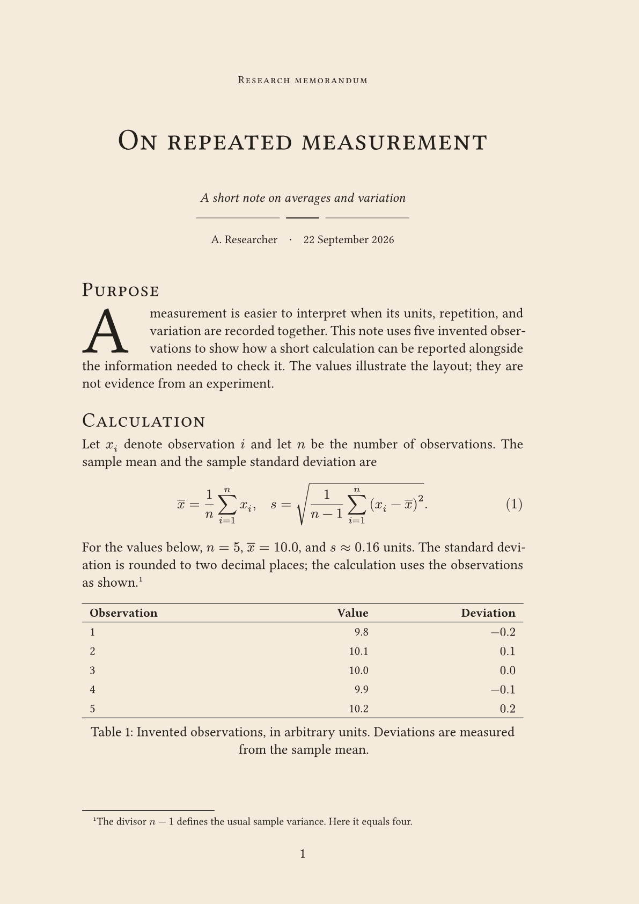

<!-- SPDX-License-Identifier: MIT-0 -->
# sepia-memo

Research memos with cream paper, classical serif typography, small-cap headings,
printer's rules, and readable mathematics and tables. Adapted from
[Foadsf/vintage-latex](https://github.com/Foadsf/vintage-latex), with modern
spelling and numerals. No package dependencies or font installation are needed
for the default appearance.

Version 0.1.2 is a repository-only update. It has not been submitted to Typst
Universe. The existing [version 0.1.0 submission #5916](https://github.com/typst/packages/pull/5916)
remains unchanged and is awaiting review. Registry imports require a local
package installation until the corresponding version is published.
Requires Typst 0.15.0 or newer.



## Changes in 0.1.2

- Added a ready-to-compile [Garamond example](example-garamond.typ) using
  EB Garamond for text and Garamond-Math for equations.
- Expanded [font setup instructions](#optional-garamond-appearance), including
  macOS installation, font discovery, custom font directories, and editor preview.
- Default fonts, typography, and the template API are unchanged.

## Changes in 0.1.1

- Larger text: 13 pt body, 28 pt memo title, and 19 pt level-1 headings with
  small caps retained. Level-2 headings use 17 pt italic; level-3 use 14 pt bold.
- More space above and below the printer's rule, increased from 0.7 em to 1.15 em.
- Larger byline, subtitle, table text, margin notes, and footnotes.
- Updated preview image. Larger typography can increase the page count.

## Try it now

Clone the repository and compile the [example](example.typ):

```sh
git clone https://github.com/ChennoShen239/sepia-memo.git
cd sepia-memo
typst compile example.typ example.pdf
```

Edit `example.typ` for the title, author, date, and appearance. Edit
`template/content.typ` for the sample body. For automatic PDF updates while
writing, run `typst watch example.typ example.pdf` and open the PDF in a viewer
that reloads changed files.

Browser preview is provided separately by an editor integration such as
[Tinymist](https://myriad-dreamin.github.io/tinymist/feature/preview.html).
Open the containing folder as your editor project. In a multi-file project,
keep `example.typ` selected as the main document for compilation and preview.
The content file only defines a function and does not render a memo by itself.

## Use as a package

The following works with a [local package installation](https://github.com/typst/packages#local-packages)
and will work from the registry once version 0.1.2 is published on Typst Universe:

```typ
#import "@preview/sepia-memo:0.1.2": memo, memo-note, printer-rule

#show: memo.with(
  title: [A research note],
  author: "Your name",
  date: [22 September 2026],
)

= Question

Write your note here.

#memo-note[Check the units.][
  A short paragraph with a note in the right margin.
]

#printer-rule()
```

When using a checkout directly, replace the package import with `"lib.typ"`
and place your document beside that file. To adapt an existing document, keep
its content and select its existing paper size explicitly, for example
`paper: "us-letter"`.

After version 0.1.2 is published on Universe, create a new project with:

```sh
typst init @preview/sepia-memo:0.1.2 my-memo
typst compile my-memo/main.typ my-memo/main.pdf
```

## Options

`memo` wraps the document with a show rule. Its options are:

| Option | Default | Purpose |
| --- | --- | --- |
| `title` | `[Untitled memo]` | Title content and PDF title metadata |
| `subtitle` | `none` | Optional subtitle content |
| `author` | `""` | Author string and PDF author metadata |
| `date` | `none` | Optional date content or string; never changes automatically |
| `paper` | `"a4"` | Paper name, such as `"us-letter"` |
| `font` | `"Libertinus Serif"` | Body font family |
| `math-font` | `"New Computer Modern Math"` | OpenType math font family |
| `paper-color` | `rgb("#F4EBDD")` | Page background; use `white` for printing |
| `ink` | `rgb("#231F1A")` | Text and title-rule color |

The default fonts are embedded in the Typst CLI. Code uses DejaVu Sans Mono.
Body text is 13 pt; the memo title is 28 pt. Level-1 section headings use
small caps at 19 pt. Level-2 headings use 17 pt italic; level-3 headings use
14 pt bold.
The fixed margins are 25 mm top, 26 mm bottom, 27 mm left, and 38 mm right.
The layout is intended for portrait A4 and US Letter pages.

Headings, equations, references, footnotes, figures, and bibliographies remain
ordinary Typst elements. Equation numbering is opt-in with
`#set math.equation(numbering: "(1)")`. Table text uses lining tabular numerals;
add table rules with `table.hline` as shown in the starter.
Table figures can break across pages; use `table.header(repeat: true, ...)`
for a repeating header in a long table.

`printer-rule()` inserts a three-part divider. Its optional `ink` parameter
sets its color. Import it alongside `memo` when needed.

`memo-note(note)[paragraph]` places a short note in the right margin alongside
one short paragraph. It reserves the height of both, so successive note blocks
do not overlap. The block stays on one page; use normal footnotes for long
notes. Use it at the top level with the standard memo margins, not inside a
table, column, or another narrow container.

## Optional Garamond appearance

Use **EB Garamond** for text and **Garamond-Math** for equations. The math font
is [designed to match EB Garamond](https://github.com/YuanshengZhao/Garamond-Math).
This option needs locally available fonts; the default appearance still works
without installing anything.

### 1. Make both font families available

Obtain the regular, italic, bold, and bold-italic EB Garamond faces from the
[EB Garamond project](https://github.com/octaviopardo/EBGaramond12) or the
[CTAN distribution](https://ctan.org/pkg/ebgaramond). Also obtain
[Garamond-Math.otf](https://github.com/YuanshengZhao/Garamond-Math/blob/master/Garamond-Math.otf).
The static OpenType files used for local validation were:

```text
EBGaramond-Regular.otf
EBGaramond-Italic.otf
EBGaramond-Bold.otf
EBGaramond-BoldItalic.otf
Garamond-Math.otf
```

Install them through your operating system's font manager. On macOS, open
these files in Font Book and click **Install**; see
[Apple's font installation guide](https://support.apple.com/guide/font-book/install-and-validate-fonts-fntbk1000/mac).
Then restart your editor and its preview so they rescan the fonts.

If you use TeX Live, the fonts may already be present in its font directories.
Locate them with `kpsewhich EBGaramond-Regular.otf` and
`kpsewhich Garamond-Math.otf`; the other EB Garamond faces are usually beside
the regular face. Fonts found by TeX are not necessarily visible to Typst.
Install the files through your font manager or use the custom directory method
below. Empty `kpsewhich` output means that file was not found.

### 2. Check discovery and select the fonts

Run `typst fonts`. Its output should include both exact family names:

```text
EB Garamond
Garamond-Math
```

Add these two options to your existing `memo.with(...)` call:

```typ
font: "EB Garamond",
math-font: "Garamond-Math",
```

Changing `font` selects the text family; `math-font` separately selects the
OpenType math family. Keep your other memo options unchanged.

### 3. Compile the Garamond example

From this repository's root, run:

```sh
typst compile example-garamond.typ example-garamond.pdf
```

The [example source](example-garamond.typ) uses a relative import, so it works
before version 0.1.2 is published on Typst Universe. It includes prose, small-cap
headings, equations, a table, a footnote, and a margin note. Garamond can change
line breaks and pagination.

### Alternative: use a font directory without installing

Put the five font files in a directory of your choice, then pass that same
path to both commands:

```sh
typst fonts --font-path /path/to/fonts
typst compile --font-path /path/to/fonts example-garamond.typ example-garamond.pdf
```

A CLI `--font-path` flag does not configure an editor's separate preview
process. For Zed/Tinymist, install the fonts system-wide or for your user account,
or configure the editor's own font paths. If the CLI works but preview still
uses old fonts, restart the editor and preview. An `unknown font family` warning
means the requested font is unavailable to that process.

In the Typst web app, upload the font files into your project if the families
are unavailable; see [Typst's font documentation](https://typst.app/docs/reference/text/text/#parameters-font).
No font files are bundled here. The font software has its own OFL-1.1 terms;
retain its licenses and notices if redistributing it separately.

## Attribution and licenses

The adapted library follows vintage-latex example 01 at commit
`559011918849a3da819912a7c26493071d542df5`, with the optional Garamond math pairing
from example 15. Copyright (c) 2026 the repository contributors; adaptation
copyright (c) 2026 Chen Gao. See [NOTICE](NOTICE) for the source and changes.

| Files | License |
| --- | --- |
| `lib.typ`, `thumbnail.png` | [CC BY-SA 4.0](licenses/CC-BY-SA-4.0.txt) |
| `template/*`, `example.typ`, `example-garamond.typ`, `typst.toml`, `README.md`, `.gitignore` | [MIT-0](licenses/MIT-0.txt) |
| `LICENSE`, `NOTICE`, `licenses/*` | License and attribution notices, retained as applicable |

The independently written starter prose and invented measurements are not
copied from the upstream examples or from private research files. The MIT-0
license lets users edit and distribute these starter files without attribution
or notice requirements. It does not change the library's CC BY-SA obligations.

Authors retain rights in their original writing. Whether a particular output
has upstream obligations depends on any protected upstream material it contains
or adapts; this package offers no blanket output exception. The supplied sample
PDF and thumbnail may be shared under CC BY-SA 4.0. No fonts, engraved figures,
or fiziko code are distributed.

See [LICENSE](LICENSE) for the complete scope of each license and the links to
its terms. No endorsement by upstream authors is claimed.
