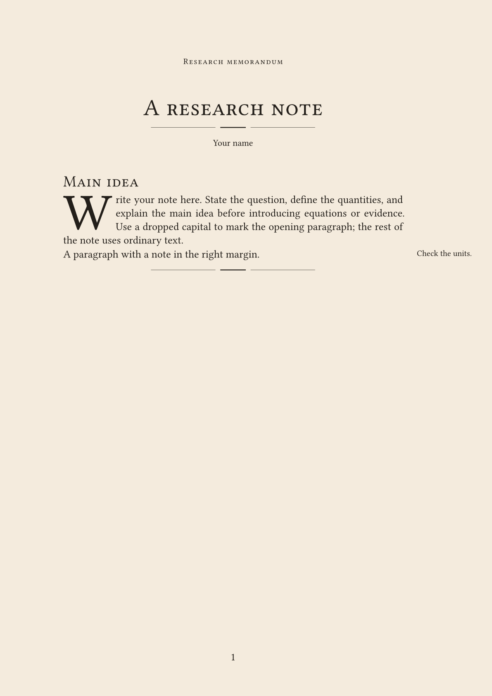

<!-- SPDX-License-Identifier: MIT-0 -->
# sepia-memo

Research memos with cream paper, classical serif typography, small-cap headings,
printer's rules, and readable mathematics and tables. Adapted from
[Foadsf/vintage-latex](https://github.com/Foadsf/vintage-latex), with modern
spelling and numerals. The memo style needs no extra fonts or packages; the starter uses
[droplet](https://typst.app/universe/package/droplet/) for an optional drop cap.
Requires Typst 0.15.0 or newer.

Version 0.1.2 is a repository-only version. The existing
[Typst Universe submission #5916](https://github.com/typst/packages/pull/5916)
still contains 0.1.0. Registry imports require local installation until the
corresponding version is published.

## Preview

First page of the complete [starter](template/main.typ), with a drop capital,
equations, a table, and footnotes:


## Usage

For a shorter example, import the package and apply `memo` to your document:

```typ
#import "@preview/sepia-memo:0.1.2": memo, memo-note, printer-rule
#import "@preview/droplet:0.3.1": dropcap

#show: memo.with(title: [A research note], author: "Your name")

= Main idea

#dropcap(height: 3, gap: 4pt)[
  Write your note here. State the question, define the quantities, and explain
  the main idea before introducing equations or evidence. Use a dropped capital
  to mark the opening paragraph; the rest of the note uses ordinary text.
]

#memo-note[Check the units.][A paragraph with a note in the right margin.]

#printer-rule()
```

Output of this shorter example:



## Start a memo

The [starter](template/main.typ) contains memo settings and sample content in
one file. Edit its title, author, date, and body to write your note.

After version 0.1.2 is published on Universe, start a project with:

```sh
typst init @preview/sepia-memo:0.1.2 my-memo
typst watch my-memo/main.typ my-memo/main.pdf
```

## Options

Apply `memo.with(...)` with a show rule, as in the starter. All options are
optional; the document body follows the show rule as ordinary Typst content.

| Option | Default | Purpose |
| --- | --- | --- |
| `title` | `[Untitled memo]` | Title content and PDF title metadata |
| `subtitle` | `none` | Optional subtitle content |
| `author` | `""` | Author string and PDF author metadata |
| `date` | `none` | Date content or string; never changes automatically |
| `paper` | `"a4"` | Paper name, such as `"us-letter"` |
| `font` | `"Libertinus Serif"` | Body font family |
| `math-font` | `"New Computer Modern Math"` | OpenType math font family |
| `paper-color` | `rgb("#F4EBDD")` | Page background; use `white` for printing |
| `ink` | `rgb("#231F1A")` | Text and title-rule color |

Default fonts are embedded in the Typst CLI. Code uses DejaVu Sans Mono.
Body text is 13 pt; the title is 28 pt. Level-1 headings use 19 pt small caps,
level-2 use 17 pt italic, and level-3 use 14 pt bold. Fixed margins are 25 mm
top, 26 mm bottom, 27 mm left, and 38 mm right, intended for portrait A4 and
US Letter. When adapting an existing document, select its paper size explicitly.

Headings, equations, references, footnotes, figures, and bibliographies remain
ordinary Typst elements. Opt into equation numbering with
`#set math.equation(numbering: "(1)")`. Tables use lining tabular numerals;
add rules with `table.hline`. Table figures can span pages; use
`table.header(repeat: true, ...)` to repeat a long table's header.

Import `printer-rule` alongside `memo` to insert a three-part divider with
`#printer-rule()`. Its optional `ink` parameter sets the color.

`memo-note(note)[paragraph]` pairs a short paragraph with a right-margin note.
It reserves both heights to prevent overlap and stays on one page. Use it at
the top level with the standard memo margins, not inside a table, column, or
narrow container. Use ordinary footnotes for long notes.

## Optional drop capital

The starter and Usage example import `dropcap` directly from
[droplet 0.3.1](https://typst.app/universe/package/droplet/), then wrap the opening
paragraph in `#dropcap(height: 3, gap: 4pt)[...]`. The first letter spans three
lines; text returns to full width below it. It inherits the memo's text font,
including optional Garamond. No extra function or setting in `memo` is needed.

Use it on one prose paragraph at a time. Keep tables, display equations, and
margin notes outside the wrapper. Droplet splits at word boundaries and has
[wrapping limitations](https://typst.app/universe/package/droplet/#paragraph-splitting).
For an ordinary opening paragraph, remove the wrapper and the droplet import.
Typst downloads droplet on first use; later builds can use the cached package.

## Optional Garamond appearance

In the starter's existing `memo.with(...)` call, add:

```typ
font: "EB Garamond",
math-font: "Garamond-Math",
```

The first option changes text; the second changes equations. Garamond can
change line breaks and pagination. Both font families must be available to
the compiler or preview process.

Obtain the regular, italic, bold, and bold-italic EB Garamond faces from the
[EB Garamond project](https://github.com/octaviopardo/EBGaramond12) or
[CTAN](https://ctan.org/pkg/ebgaramond), and
[Garamond-Math.otf](https://github.com/YuanshengZhao/Garamond-Math/blob/master/Garamond-Math.otf).
The static files used for validation were `EBGaramond-Regular.otf`,
`EBGaramond-Italic.otf`, `EBGaramond-Bold.otf`, `EBGaramond-BoldItalic.otf`, and
`Garamond-Math.otf`.

Install them through your operating system's font manager. On macOS, use
[Font Book](https://support.apple.com/guide/font-book/install-and-validate-fonts-fntbk1000/mac).
Restart your editor and preview to rescan fonts. Run `typst fonts` and check
for the exact family names `EB Garamond` and `Garamond-Math`.

With TeX Live, `kpsewhich EBGaramond-Regular.otf` and
`kpsewhich Garamond-Math.otf` locate installed files; the other text faces are
usually beside the regular face. Empty output means the file was not found.
Fonts visible to TeX are not necessarily visible to Typst: install them through
your font manager or point Typst at their directory:

```sh
typst fonts --font-path /path/to/fonts
typst compile --font-path /path/to/fonts main.typ memo.pdf
```

This command assumes a project created with `typst init`. For a Git checkout,
use the input path and `--root .` from the instructions below.
A CLI `--font-path` flag does not configure an editor's separate preview
process. For Zed/Tinymist, install fonts for your user or configure its font
paths, then restart the preview. An `unknown font family` warning means that
process cannot find the requested font.

In the Typst web app, upload fonts into your project if unavailable; see
[Typst's font documentation](https://typst.app/docs/reference/text/text/#parameters-font).
No fonts are bundled here. Font software has separate OFL-1.1 terms; retain
its licenses and notices if redistributing it separately.

## Local development and preview

To try an unpublished checkout:

```sh
git clone https://github.com/ChennoShen239/sepia-memo.git
cd sepia-memo
```

In `template/main.typ`, replace the first import with this local import:

```typ
#import "../lib.typ": memo, memo-note
```

Then compile or watch from the repository root:

```sh
typst compile --root . template/main.typ memo.pdf
typst watch --root . template/main.typ memo.pdf
```

Open the PDF in a viewer that reloads changed files. For browser preview, use
an editor integration such as [Tinymist](https://myriad-dreamin.github.io/tinymist/feature/preview.html).
Open the repository folder as the editor project and select `template/main.typ`
as the main document. The project root must include `lib.typ` for local imports.

## Attribution and licenses

The adapted library follows vintage-latex example 01 at commit
`559011918849a3da819912a7c26493071d542df5`, with the optional Garamond math pairing
from example 15. Copyright (c) 2026 the repository contributors; adaptation
copyright (c) 2026 Chen Gao. See [NOTICE](NOTICE) for the source and changes.

| Files | License |
| --- | --- |
| `lib.typ`, `thumbnail.png`, `usage.png` | [CC BY-SA 4.0](licenses/CC-BY-SA-4.0.txt) |
| `template/main.typ`, `typst.toml`, `README.md`, `.gitignore` | [MIT-0](licenses/MIT-0.txt) |
| `LICENSE`, `NOTICE`, `licenses/*` | License and attribution notices, retained as applicable |

Starter prose and invented measurements were written independently. MIT-0 lets
users edit and distribute the starter without attribution or notice requirements;
it does not change the library's CC-BY-SA obligations. Authors retain rights in
their own writing. An output's obligations depend on any protected upstream
material it contains or adapts; this package grants no blanket output exception.
The supplied sample PDF and preview images may be shared under CC-BY-SA-4.0.

The optional drop-cap package, droplet 0.3.1 by Eric Biedert, is separately
distributed under [MIT](https://github.com/typst/packages/blob/main/packages/preview/droplet/0.3.1/LICENSE).
It is imported from Universe; its source is not copied into this package.

No upstream demonstration prose, fonts, engraved figures, or fiziko code are
distributed. See [LICENSE](LICENSE) for file-level scope and full terms.
No endorsement by upstream authors is claimed.
