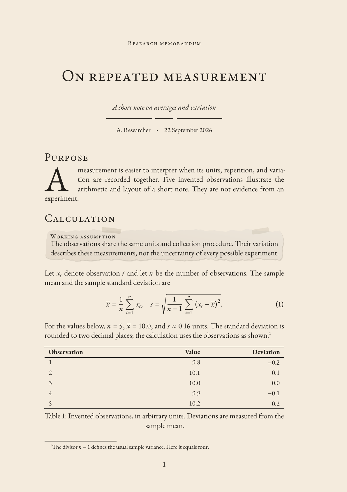
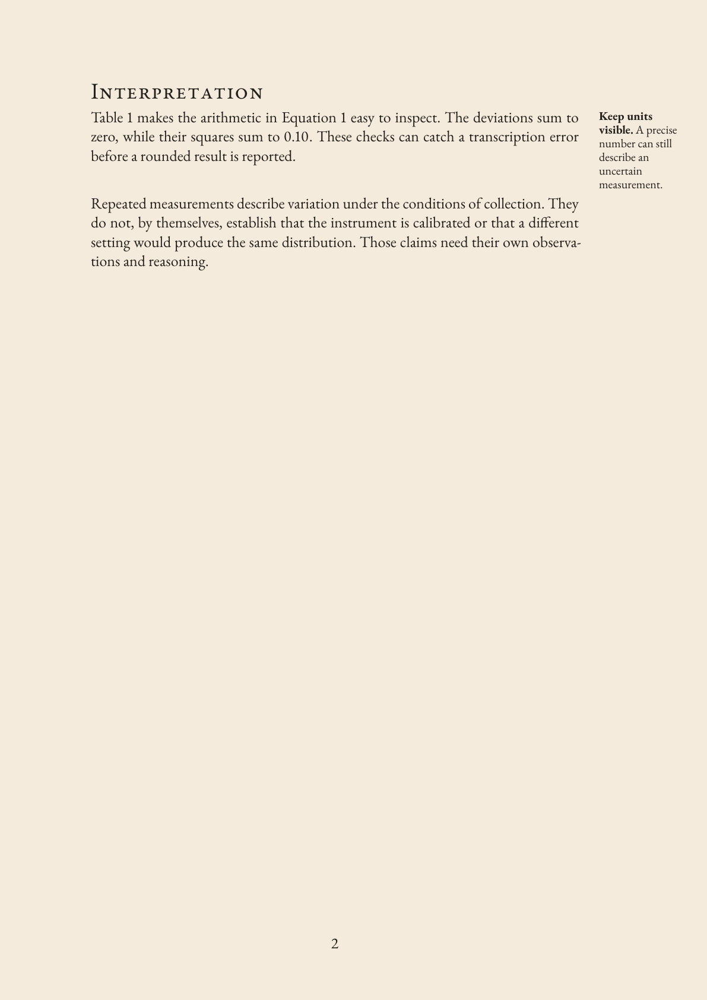
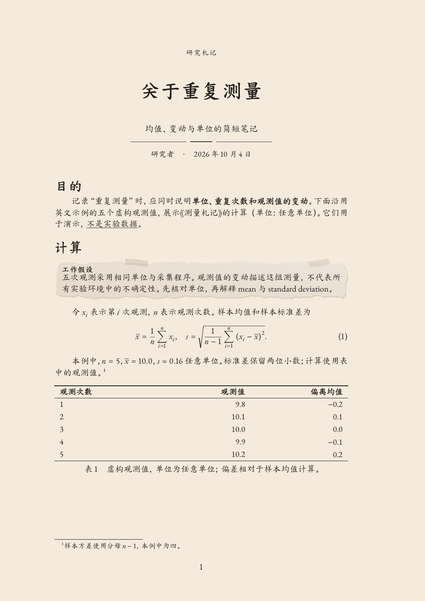
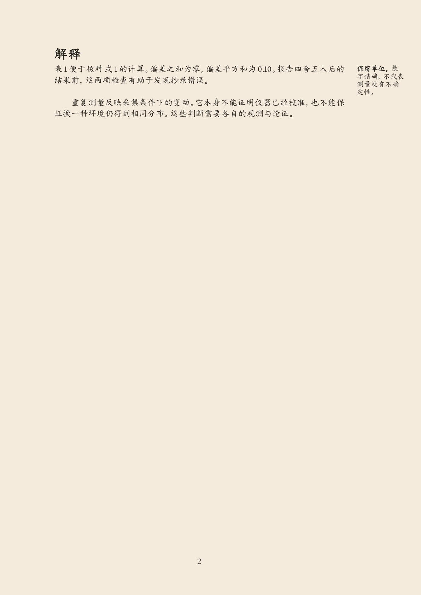

<!-- SPDX-License-Identifier: MIT-0 -->
# sepia-memo

Research memos with cream paper, Garamond Latin text and mathematics, Chinese handwriting,
drop capitals, margin notes, and torn-paper emphasis blocks. Requires Typst 0.15.0 or newer.

Available on [Typst Universe](https://typst.app/universe/package/sepia-memo/).

## Setup

Install [EB Garamond](https://ctan.org/pkg/ebgaramond) (regular, italic, bold,
and bold italic) and [Garamond-Math](https://github.com/YuanshengZhao/Garamond-Math/blob/42b7c154422ae45e6f834654648da4ac467c656b/Garamond-Math.otf).
On desktop, install through your font manager and restart the editor/preview;
verify both families with `typst fonts`. Alternatively pass `--font-path /path/to/fonts`.
In the Typst web app, upload them to your project if unavailable. Fonts are not
bundled. The starter downloads `droplet:0.3.1` on first compilation.

## Usage

[template/main.typ](template/main.typ) is the only starter. Edit its metadata
and body. The complete example below is the same file; both rendered pages follow.

```typ
// SPDX-License-Identifier: MIT-0
// Copyright (c) 2026 Chen Gao
#import "@preview/sepia-memo:0.3.0": memo, memo-note, memo-inset
#import "@preview/droplet:0.3.1": dropcap

#show: memo.with(
  title: [On repeated measurement],
  subtitle: [A short note on averages and variation],
  author: "A. Researcher",
  date: [22 September 2026],
)

// ponytail: One starter; optional fonts use the same memo settings.
#set math.equation(numbering: "(1)")

= Purpose

#dropcap(height: 3, gap: 4pt)[
  A measurement is easier to interpret when its units, repetition, and variation
  are recorded together. Five invented observations illustrate the arithmetic and
  layout of a short note. They are not evidence from an experiment.
]

= Calculation

#memo-inset(title: [Working assumption])[
  The observations share the same units and collection procedure. Their variation
  describes these measurements, not the uncertainty of every possible experiment.
]

Let $x_i$ denote observation $i$ and let $n$ be the number of observations. The
sample mean and the sample standard deviation are

$
  overline(x) = 1/n sum_(i=1)^n x_i,
  quad s = sqrt(1/(n - 1) sum_(i=1)^n (x_i - overline(x))^2).
$ <eq-summary>

For the values below, $n = 5$, $overline(x) = 10.0$, and $s approx 0.16$ units.
The standard deviation is rounded to two decimal places; the calculation uses
the observations as shown.#footnote[The divisor $n - 1$ defines the usual sample
  variance. Here it equals four.]

#block(breakable: false)[
#figure(
  table(
    columns: (1fr, 1fr, 1fr),
    align: (left, right, right),
    table.hline(stroke: 0.6pt),
    table.header([*Observation*], [*Value*], [*Deviation*]),
    table.hline(stroke: 0.3pt),
    [1], [9.8], [$-0.2$],
    [2], [10.1], [$0.1$],
    [3], [10.0], [$0.0$],
    [4], [9.9], [$-0.1$],
    [5], [10.2], [$0.2$],
    table.hline(stroke: 0.6pt),
  ),
  caption: [Invented observations, in arbitrary units. Deviations are measured
    from the sample mean.],
) <tab-observations>
]

= Interpretation

#memo-note[
  *Keep units visible.* A precise number can still describe an uncertain
  measurement.
][
  @tab-observations makes the arithmetic in @eq-summary easy to inspect. The
  deviations sum to zero, while their squares sum to $0.10$. These checks can
  catch a transcription error before a rounded result is reported.
]

Repeated measurements describe variation under the conditions of collection.
They do not, by themselves, establish that the instrument is calibrated or
that a different setting would produce the same distribution. Those claims
need their own observations and reasoning.
```

**Page 1: drop capital, torn-paper block, equations, table, and footnote.**



**Page 2: the right-margin note created by `memo-note`.**



Create and watch a memo with:

```sh
typst init @preview/sepia-memo:0.3.0 my-memo
typst watch my-memo/main.typ my-memo/main.pdf
```

## Options

Set these in `memo.with(...)`. The body follows the show rule normally.

| Option | Default | Purpose |
| --- | --- | --- |
| `title` | `auto` | Title and PDF metadata; defaults to Untitled memo or 未命名札记 |
| `subtitle` | `none` | Subtitle content |
| `author` | `""` | Author string and PDF metadata |
| `date` | `none` | Date content or string |
| `paper` | `"a4"` | Paper size; also supports `"us-letter"` |
| `lang` | `"en"` | Text language; `"zh"` enables Chinese typography |
| `font` | `auto` | EB Garamond; Chinese adds ChillKai handwriting |
| `math-font` | `"Garamond-Math"` | Math font |
| `paper-color` | `rgb("#F4EBDD")` | Background; use `white` for printing |
| `ink` | `rgb("#231F1A")` | Text and title-rule color |

For fonts embedded in the Typst CLI, set `font: "Libertinus Serif"` and
`math-font: "New Computer Modern Math"`; the layout will differ from the preview.

- `memo-note(note)[paragraph]`: one short paragraph with a right-margin note.
  Use at the top level with the standard margins; the pair stays on one page.
- `memo-inset(title: [Assumption])[content]`: a torn-paper emphasis block.
  Use at the top level inside `memo`; it can contain prose, equations, and tables
  and continue across pages. The title is optional. Tape placement varies by block
  and stays stable when recompiling the same document.
- `printer-rule()`: import it from sepia-memo for a three-part divider.
  Its `ink` option defaults to `rgb("#231F1A")`.
- The starter's three-line drop cap comes from [droplet](https://typst.app/universe/package/droplet/).
  Wrap prose only; keep tables, display equations, and margin notes outside it.
  To remove it, delete the `dropcap(...)` wrapper and droplet import.

## Local preview

Open the repository folder. In `template/main.typ`, change only the sepia-memo
import path to `"../lib.typ"`, then run from the repository root:

```sh
typst watch --root . template/main.typ memo.pdf
```

Save edits to refresh the PDF, or open `template/main.typ` with your editor's
[Tinymist browser preview](https://myriad-dreamin.github.io/tinymist/feature/preview.html).

## Chinese

Chinese support is available in this repository, pending a Universe release.
Install [ChillKai 2.0 (寒蝉正楷)](https://github.com/Warren2060/Chillkai/releases/tag/v2.000)
alongside the Garamond fonts, then set `lang: "zh"` in `memo.with(...)`.
This selects 12 pt Chinese handwriting, two-character paragraph indentation, upright
headings, outlined strong text, underlined emphasis, and the header 研究札记.
Latin text and mathematics retain their Garamond fonts. Typst handles Chinese
punctuation and mixed-script spacing.

ChillKai has one Regular face, with no bold or italic variants. Chinese titles,
headings, pasted-note titles, and `*strong*` use a 0.020 em outline on Chinese glyphs
and punctuation; Latin strong text uses Garamond's bold face. Body text remains
Regular, and `_emphasis_` uses an underline. Explicit `text(weight: "bold")` or
`text(style: "italic")` still selects Regular for ChillKai. Outlining leaves the
font file unchanged. English mode retains Garamond's bold and italic faces.

[examples/chinese.typ](examples/chinese.typ) is the complete Chinese example.
Body text, margin notes, and pasted annotations use the same Chinese font.
For a printed-book alternative, install Source Han Serif SC and set
`font: ((name: "EB Garamond", covers: "latin-in-cjk"), "Source Han Serif SC")`.
Drop capitals remain optional through droplet; the Chinese example uses ordinary paragraphs.

```sh
typst watch --root . examples/chinese.typ chinese.pdf
```





## Licenses and dependencies

Adapted from [Foadsf/vintage-latex](https://github.com/Foadsf/vintage-latex).
[NOTICE](NOTICE) records the source revision and changes; [LICENSE](LICENSE)
defines the file boundaries and links to complete terms.

| Included files | License |
| --- | --- |
| `lib.typ`, `thumbnail.png`, `preview-*.png` | [CC BY-SA 4.0](licenses/CC-BY-SA-4.0.txt) |
| `template/main.typ`, `examples/*`, `README.md`, `typst.toml`, `CONTEXT.md`, `tests/*`, `.gitignore` | [MIT-0](licenses/MIT-0.txt) |

| External requirement | License |
| --- | --- |
| Typst 0.15.0+ compiler | [Apache-2.0](https://github.com/typst/typst/blob/v0.15.0/LICENSE) |
| droplet 0.3.1, imported by the starter | [MIT](https://github.com/typst/packages/blob/4d52f815df4d7789a48646033f32927ff6f92b92/packages/preview/droplet/0.3.1/LICENSE) |
| EB Garamond | [OFL-1.1](https://github.com/octaviopardo/EBGaramond12/blob/106a4a6d377987459ae5e68673a4570f13b957fb/OFL.txt) |
| Garamond-Math | [OFL-1.1](https://github.com/YuanshengZhao/Garamond-Math/blob/42b7c154422ae45e6f834654648da4ac467c656b/LICENSE) |
| ChillKai, for Chinese handwriting | [OFL-1.1](https://github.com/Warren2060/Chillkai/blob/ab172bd33249136db70e177e8a22d3ae721652dd/LICENSE) |
| Source Han Serif SC, optional Chinese print font | [OFL-1.1](https://github.com/adobe-fonts/source-han-serif/blob/7889f11bf31170b5d092a083b357c8c8130f89e0/LICENSE.txt) |

External tools, package code, and fonts are not bundled. Retain their respective
licenses and notices if redistributing them separately. Embedding OFL fonts does
not license the document under OFL. Authors retain rights in their own text;
any protected upstream material in an output retains its applicable obligations.
